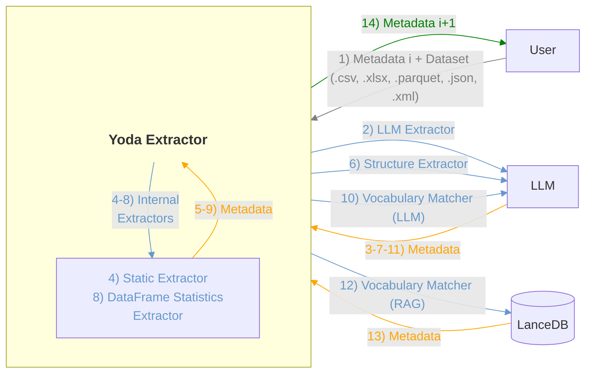

# Yoda Extractor

A streaming metadata extractor for large structured data files. Processes records one at a time (O(1) memory) and produces metadata summaries without loading the full file into memory.

## Architecture



## Profile support
HealthDCAT-AP: https://healthdataeu.pages.code.europa.eu/healthdcat-ap/releases/release-7/

## Example of output

```json
{
  "access_rights": "http://publications.europa.eu/resource/authority/access-right/NON_PUBLIC",
  "identifier": "https://catalogo.ends.gob.es/dataset",
  "access_url": "https://catalogo.ends.gob.es/dataset",
  "title": "Un perfil de las personas mayores en España, 2024",
  "notes": "Un perfil de las personas mayores en España, 2024. Indicadores estadísticos básicos",
  "health_category": [
    "http://13.81.34.152:1101/resource/authority/healthcategories/MRMR",
    "http://13.81.34.152:1101/resource/authority/healthcategories/HRAD"
  ],
  "theme": [
    "http://publications.europa.eu/resource/authority/data-theme/HEAL"
  ],
  "dcat_type": "http://publications.europa.eu/resource/authority/dataset-type/STATISTICAL",
  "provenance": "Fuentes nacionales e internacionales",
  "keyword": [
    "Personas mayores",
    "datos estadísticos",
    "indicadores",
    "España",
    "demografía",
    "salud",
    "pensiones",
    "hogares"
  ],
  "purpose": [
    "Proporcionar una visión conjunta de las condiciones de vida de la población de 65 y más años"
  ],
  "language": [
    "http://publications.europa.eu/resource/authority/language/SPA"
  ],
  "population_coverage": [
    "Personas mayores en España"
  ],
  "min_typical_age": 6,
  "personal_data": [
    "https://w3id.org/dpv/pd#Age",
    "https://w3id.org/dpv/pd#AgeRange",
    "https://w3id.org/dpv/pd#HealthData"
  ],
  "health_theme": [
    "http://13.81.34.152:1101/resource/authority/health-theme/HEALTH_SYSTEMS",
    "http://13.81.34.152:1101/resource/authority/health-theme/MENTAL_HEALTH"
  ],
  "hdab": {
    "name": "CSIC",
    "type": "http://13.81.34.152:1101/resource/authority/publisher-type/stat-agency",
    "contact": "https://www.csic.es/es",
    "email": "CSIC@csic.es",
    "telephone": "789 39 15 67",
    "opening_hours_description": "De lunes a viernes de 8:00 a 14:00",
    "opening_hours_frequency": "http://publications.europa.eu/resource/authority/frequency/1MIN",
    "special_opening_hours_description": "Los festivos no abren",
    "special_opening_hours_frequency": "http://publications.europa.eu/resource/authority/frequency/TRIHOURLY"
  },
  "contact": {
    "email": "enred@cchs.csic.es",
    "url": "https://envejecimientoenred.csic.es"
  },
  "download_url": "https://envejecimientoenred.csic.es/wp-content/uploads/2024/12/enred-indicadoresbasicos2024.pdf",
  "name": "enred",
  "description": "Indicadores estadísticos básicos",
  "format": "pdf",
  "mimetype": "application/pdf",
  "rights": "Creative Commons 4.0",
  "license": "Creative Commons 4.0",
  "publisher": {
    "name": "Envejecimiento en red y Estadísticas experimentales",
    "type": "http://13.81.34.152:1101/resource/authority/publisher-type/research-academic-org",
    "email": "enred@cchs.csic.es",
    "telephone": null,
    "contact_page": "https://envejecimientoenred.csic.es"
  },
  "creator": {
    "name": "Julio Pérez Díaz, Ana Belén Castillo Belmonte, Pilar Aceituno Nieto, Diego Ramiro Fariñas, Dariya Ordanovich",
    "type": "http://13.81.34.152:1101/resource/authority/publisher-type/research-academic-org",
    "email": null,
    "url": null
  },
  "qualified_attribution": {
    "qualified_attribution_agent_name": "Envejecimiento en red y Estadísticas experimentales",
    "qualified_attribution_agent_type": "http://13.81.34.152:1101/resource/authority/publisher-type/research-academic-org",
    "qualified_attribution_agent_contact_page": "https://envejecimientoenred.csic.es",
    "qualified_attribution_agent_email": "enred@cchs.csic.es",
    "qualified_attribution_role": "https://standards.iso.org/iso/19115/resources/Codelists/gml/CI_RoleCode.xml#author"
  },
  "was_generated_by": [
    "http://13.81.34.152:1101/resource/authority/health-activity/RESEARCH_DATABASE"
  ],
  "spatial": [
    "http://publications.europa.eu/resource/authority/country/ESP"
  ],
  "issued": "2024-12-30",
  "url": "https://envejecimientoenred.csic.es/datos-abiertos/residencias/",
  "number_of_unique_individuals": 1000,
  "number_of_records": 1000,
  "max_typical_age": 80,
  "legal_basis": {
    "description": "RGPD",
    "source": "https://www.boe.es/doue/2016/119/L00001-00088.pdf"
  },
  "retention_period": {
    "start": "2026-01-01",
    "end": "2027-01-01"
  },
  "coding_system": {
    "uri": null,
    "label": "Diccionario regulatorio de médicos"
  },
  "code_values": [
    "ISD-10"
  ],
  "compress_format": "zip",
  "package_format": "zip",
  "size": 20000,
  "hash": "5d41402abc4b2a76b9719d911017c592",
  "hash_algorithm": "md5",
  "status": "http://purl.org/adms/status/UnderDevelopment",
  "availability": "en proceso",
  "publisher_note": "El editor no dice nada",
  "quality_annotation": {
    "body": "Ministerio de Sanidad",
    "target": "Se encargará de evaluar la calidad de los datos",
    "motivated_by": "Su principal motivación viene dada por la preocupación de que se filtren datos personales"
  },
  "temporal_coverage": {
    "start": "2025-05-01",
    "end": "2026-05-01"
  },
  "temporal_resolution": "P1Y",
  "spatial_resolution_in_meters": "500",
  "frequency": "http://publications.europa.eu/resource/authority/frequency/ANNUAL",
  "modified": "2026-06-02",
  "alternate_identifier": [
    "https://envejecimientoenred.csic.es/datos-abiertos/residencias"
  ],
  "conforms_to": {
    "uri": "ISO 13000",
    "label": "ISO 13000"
  },
  "related_resource": {
    "uri": "file:///C:/Users/SW273BT/Downloads/Gu%C3%ADa%20de%20campos%20%E2%80%93%20HealthDCAT-AP%20(1).pdf",
    "label": "Guía de campos – HealthDCAT-AP"
  },
  "is_referenced_by": [
    "https://envejecimientoenred.csic.es/datos-abiertos/residencias/"
  ],
  "documentation": {
    "uri": "https://envejecimientoenred.csic.es/datos-abiertos/residencias/",
    "label": "Documentación"
  },
  "version": "1.0",
  "has_version": [
    "1.0"
  ],
  "version_notes": "es la primera versión",
  "applicable_legislation": [
    {
      "uri": "http://data.europa.eu/eli/reg/2016/679/oj",
      "label": "GDPR"
    },
    {
      "uri": "http://data.europa.eu/eli/reg/2025/327/oj",
      "label": "Reglamento EHDS"
    }
  ]
}
```

## Supported formats

| Format | Extension | Notes |
|--------|-----------|-------|
| CSV | `.csv` | |
| JSON | `.json` | |
| XML | `.xml` | Nested elements flattened to dot-notation; simple leaf text uses the tag name directly (no `._text` suffix) |
| Excel | `.xlsx`, `.xls` | |
| Parquet | `.parquet` | |

## Installation

```bash
pip install -r requirements.txt
```

## Usage

```bash
python main.py <file> [--output json|text] [--log-level LEVEL] [--log-file PATH] [--input-json PATH_OR_STRING]
```

Always saves a timestamped copy to `tests-output/<file>_<YYYYMMDD_HHMMSS>.json` regardless of output format.

### Options

| Flag | Description | Default |
|------|-------------|---------|
| `--output` | Output format: `json` or `text` | `json` |
| `--log-level` | `DEBUG` / `INFO` / `WARNING` / `ERROR` | `INFO` or `LOG_LEVEL` env var |
| `--log-file` | Additional path to write logs to a file | — |
| `--input-json` | Path to a JSON file containing pre-filled metadata, or an inline JSON string | — |
| `--include-tmpt` | Include internal `*_tmpt` fields in the output | `false` (auto `true` when `--log-level DEBUG`) |

### Log levels

| Level | What you see |
|-------|-------------|
| `ERROR` | LLM call failures, JSON parse errors |
| `WARNING` | Transform failures, unknown vocabulary codes, date parse issues |
| `INFO` | Pipeline progress, extractor names, record count, LLM calls, matched URIs |
| `DEBUG` | Full LLM prompt and response for every call, reservoir sampling details |

### Configuring via `.env`

Add `LOG_LEVEL` to your `.env` file (priority: `--log-level` flag > `.env` > `INFO`):

```env
GEMINI_API_KEY=your_key_here
LOG_LEVEL=DEBUG
```

### Examples

```bash
# Default run — JSON output, INFO level, saved to tests-output/
python main.py data.csv

# Human-readable text output
python main.py data.csv --output text

# See full LLM prompts and include *_tmpt fields in output
python main.py data.csv --log-level DEBUG

# Include *_tmpt fields without DEBUG logging
python main.py data.csv --include-tmpt

# Write logs to file
python main.py data.csv --log-file run.log

# Set level via environment variable
LOG_LEVEL=WARNING python main.py data.csv
```

## Input JSON & Computation Bypass

You can pass pre-filled metadata to Yoda Extractor via the `--input-json` flag (which accepts a path to a JSON file or an inline JSON string). If a metadata field is already populated in the input JSON, Yoda Extractor will **bypass its calculation** to save execution time and cost:

- **LLM Metadata (LLMExtractor)**: If all LLM fields are present in the input JSON, the Gemini call is skipped entirely. Otherwise, it runs the LLM but prioritizes the pre-filled values.
- **Controlled Vocabularies (VocabularyMatcher)**: If any vocabulary feature (e.g., `health_category`, `coding_system`) is pre-filled, the matcher bypasses the LLM or RAG query for that specific feature.
- **Schema Mapping (StructureExtractor)**: If all statistical fields are pre-filled, the structure mapping LLM call is skipped.
- **DataFrame Statistics (DataFrameStatisticsExtractor)**: Aggregations for pre-filled columns are skipped. Furthermore, if all statistics are pre-filled, **loading the DataFrame from the input file is completely skipped**, saving significant I/O and parsing overhead for large files.
- **Dates (StaticExtractor)**: Prefilled `issued` and `modified` dates are preserved.
Any extra keys present in the input JSON that Yoda Extractor does not generate are preserved in the final output.

## Pipeline

All extractors run together and their results are merged in order into a single JSON object.

All fields are merged at the top level; later steps overwrite earlier ones for duplicate keys. `errors` are accumulated from all steps. All fields whose name ends in `_tmpt` (e.g. `title_en_tmpt`, `notes_en_tmpt`, `keyword_en_tmpt`, `purpose_en_tmpt`, `spatial_tmpt`, `structure_tmpt`) are **internal intermediate fields** used by downstream extractors. They are **stripped from the final output** unless `LOG_LEVEL=DEBUG`.

## Available extractors

### `llm_metadata`

Calls Gemini to infer high-level metadata from the filename and a random sample of up to 20 records (capped at 30 000 chars). Uses reservoir sampling so memory stays O(1) regardless of dataset size.

**Output fields:**

| Field | Description |
|-------|-------------|
| `purpose` | Array of purposes for which the data is processed (always an array, even if empty) |
| `language` | Array of ISO 639-3 alpha-3 language codes expanded to EU authority URIs (always an array, even if empty) |
| `title` | Concise dataset title |
| `notes` | Brief description (2–4 sentences) |
| `keyword` | Array of keywords (always an array, even if empty) |
| `population_coverage` | Array of free-text descriptions of the population within the dataset (always an array, even if empty) |
| `purpose_en_tmpt` | `purpose` in English (always an array, even if empty) |
| `title_en_tmpt` | `title` in English |
| `notes_en_tmpt` | `notes` in English |
| `keyword_en_tmpt` | `keyword` in English (always an array, even if empty) |
| `errors` | Array of error messages for fields that could not be determined |

See [`docs/LLM.md`](docs/LLM.md) for full details.

### `static`

Returns fields fixed at extraction time — no record inspection, no LLM call. Also applies post-processing to the merged output (language normalization).

| Field | Description |
|-------|-------------|
| `issued` | UTC datetime when the metadata was first generated (`YYYY-MM-DDTHH:MM:SS.mmmZ`) |
| `modified` | UTC datetime when the metadata was last generated (same as `issued` on first run) |
| `format` | File extension in lowercase (e.g. `"csv"`, `"json"`). Omitted if no extension. Overridable via `--input-json`. |
| `size` | Size of the input file in bytes. Omitted if the file cannot be stat'd. Overridable via `--input-json`. |
| `hash` | SHA-256 hex digest of the input file. Omitted if the file cannot be read. Overridable via `--input-json`. |
| `hash_algorithm` | Fixed value `"SHA-256"`. Set automatically alongside `hash`. |
| `mimetype` | IANA MIME type from the input file extension (e.g. `"text/csv"`). Omitted if unknown. Overridable via `--input-json`. |
| `applicable_legislation` | Default: `[{"uri": "http://data.europa.eu/eli/reg/2016/679/oj", "label": "GDPR"}]`. Overridable via `--input-json`. |
| `description` | Copy of `notes` produced by the LLM extractor (or `notes` from `--input-json`). Skipped if `description` is already prefilled. |
| `name` | Copy of `title` produced by the LLM extractor (or `title` from `--input-json`). Skipped if `name` is already prefilled. |

**Post-processing:** normalizes `language`, `purpose`, and `purpose_en_tmpt` to always be arrays. Expands bare ISO 639-3 language codes to EU Publications Office URIs (e.g. `"ENG"` → `["http://publications.europa.eu/resource/authority/language/ENG"]`). Also applied to pre-filled input JSON values before the pipeline runs.

See [`docs/STATIC.md`](docs/STATIC.md) for full details.

### `structure`

Maps the dataset's column paths to predefined metadata fields using Gemini. Returns arrays of column paths — never the values themselves.

Fields come in **two output shapes**:

**Value fields** (`number_of_unique_individuals`, `min_typical_age`, `max_typical_age`, `spatial`) return an **array of mapping objects** `[{"columns": [...], "transform": [...]}, ...]`. Multiple objects when different column combinations independently satisfy the same field. `transform` is always an array of pandas expressions (empty `[]` for a direct single-column mapping). When multiple_output columns are combined, individual-column preparation steps come first, then the final combination last. Each expression targets `df['<field>_mod_1']`, `df['<field>_mod_2']`… (auto-numbered per field).

**Date fields** (`temporal_coverage` return an **array of date-mapping objects** `[{"year": ..., "month": ..., "day": ...}, ...]`. Each part is either `null` (absent) or `{"column": "<src>", "transform": [...]}`, and is **cleaned on its own** — the transform cleans that single column and assigns to `df['<part>_<column>']` (e.g. `df['year_Year']`). The structure step does **not** combine the parts or call `pd.to_datetime`; joining and date standardization happen in [`extractors/temporal.py`](extractors/temporal.py) (see [`temporal_coverage`](#temporal_coverage) below).

The LLM is instructed to detect European/Spanish number formatting (`.` thousands separator, `,` decimal) from sample values and emit the appropriate parse expression, and to take the first token (`str.split(r'[,/;-]').str[0]`) when a single cell holds multiple_output values (e.g. a `Month` column with `"May, June"`).

| Field | Description |
|-------|-------------|
| `number_of_unique_individuals` | Column(s) identifying a unique individual/entity |
| `min_typical_age` | Column(s) with minimum age |
| `max_typical_age` | Column(s) with maximum age |
| `spatial` | Column(s) with geographic information |
| `temporal_coverage` | Column(s) with date/time of data collection |
| `errors` | Array of error/ambiguity messages |

Nested records are flattened to dot-notation paths (e.g. `patient.demographics.age`).

See [`docs/STRUCTURE.md`](docs/STRUCTURE.md) for full details.

### `dataframe_statistics`

Computes concrete statistics from a loaded pandas DataFrame using the column mappings from the `structure_tmpt` extractor. **Not a streaming extractor** — requires a full DataFrame and the `structure_tmpt` result.

Registered in `ALL_EXTRACTORS` — runs automatically via `finalize()` after the streaming pass, receiving the loaded DataFrame and the `structure_tmpt` result.

**Output fields:**

| Field | Description |
|-------|-------------|
| `number_of_records` | Total row count (`len(df)`) |
| `number_of_unique_individuals` | Count of distinct values in the identifier column(s); applies transform if needed |
| `min_typical_age` | Min numeric value from the age column(s); applies transform if needed |
| `max_typical_age` | Max numeric value from the age column(s); applies transform if needed |
| `temporal_coverage` | `{"start", "end"}` global min/max date, resolved via `extractors/temporal.py` |

Returns `null` for any field whose structure mapping is empty or fails. See [`docs/DATA_FRAME_STATISTICS.md`](docs/DATA_FRAME_STATISTICS.md) for full details.

### `temporal_coverage` /`

Both date fields are resolved by [`extractors/temporal.py`](extractors/temporal.py) from their `structure_tmpt` date-mappings (`[{year, month, day}, ...]`). The flow:

1. **Clean each part on its own** — the structure transform for `year`/`month`/`day` cleans that single column (NaN-safe: `pd.to_numeric(..., errors='coerce').astype('Int64').astype(str)`, never bare `.astype(int)` which raises `IntCastingNaNError`).
2. **Join** the cleaned parts into one `"YYYY-MM-DD"` string column per mapping. Year is mandatory; a missing month/day defaults to `"01"`.
3. **Standardize** each value with [`utils/date_utils.py`](utils/date_utils.py) `parse_date` (explicit formats including month-name combos like `%Y-%B-%d`, then `dateutil` fallback).
4. Report the global `{"start", "end"}` (min/max) across every date-mapping of the field.

See [`docs/DATA_FRAME_STATISTICS.md`](docs/DATA_FRAME_STATISTICS.md) for full details.


## Controlled Vocabularies

Standardized reference lists used to map metadata fields to linked-data URIs. Defined in [`controlled_vocabularies/list_vocabularies.csv`](controlled_vocabularies/list_vocabularies.csv) and cached as JSON under `controlled_vocabularies/vocabs/`.


To regenerate all vocabulary JSON files:

```bash
python controlled_vocabularies/fetch_vocabularies.py
```

For vocabularies matched via **RAG**, also (re)build the vector tables after the JSON changes:

```bash
python controlled_vocabularies/build_vector_db.py
```

The fetch orchestrator dispatches each vocabulary based on `Mode_extracted_JSON`; the matcher dispatches based on `Metadata-Processed-By`:

```
controlled_vocabularies/
  fetch_vocabularies.py        ← entry point (fetch JSON)
  fetchers/
    iterative.py               ← fetches RDF endpoints concept-by-concept (network)
    personal_data.py           ← parses bundled personal_data.rdf locally (no network)
  build_vector_db.py           ← preloads the RAG vector tables
  vocabs/                      ← generated JSON files
  db/                          ← embedded LanceDB (generated, git-ignored)
```

See [`docs/CONTROLLED_VOCABS.md`](docs/CONTROLLED_VOCABS.md) for full details.

### `vocabulary`

For each controlled vocabulary in `list_vocabularies.csv`, returns the URI of the best-matching entry. The matching strategy is chosen per vocabulary via the `Metadata-Processed-By` column:

- **LLM** — one LLM call passing the dataset's English metadata (`title_en_tmpt`, `notes_en_tmpt`, `keyword_en_tmpt`) and the full vocabulary entry list.
- **RAG** — embedding similarity search (all-MiniLM-L6-v2 + LanceDB) over a precomputed table, using `purpose_en_tmpt`, `title_en_tmpt`, `notes_en_tmpt`, `keyword_en_tmpt`.
- **LLM (special)** — `spatial` uses two calls: first `LLMExtractor` produces `spatial_tmpt` (a free-text description of geographic coverage observed in the sample records), then `VocabularyMatcher` uses it to resolve URIs across four levels (provinces → autonomies → countries → continents) with a 30% threshold cascade.

Fields marked `multiple_output=true` in `list_vocabularies.csv` return an array of URIs; `multiple_output=false` fields return a single URI string. The `top-n` column controls the maximum number of results for array fields. For RAG, results within `1.2×` the best hit's distance are included, up to `top-n`.

See [`docs/CONTROLLED_VOCABS.md`](docs/CONTROLLED_VOCABS.md) for full details.


## Extending

### Add a new reader

Subclass `readers.base.BaseReader` and implement `stream_records()` as a generator that yields one `dict` per record. Register the extension in `readers/__init__.py`. See [`docs/READERS.md`](docs/READERS.md) for full details on current reader implementations and features.

### Add a new extractor

Subclass `extractors.base.BaseExtractor`, set a unique `name`, and implement:
- `update(record: dict)` — called once per record
- `result() -> dict` — called after all records are consumed

Register the class in `extractors/__init__.py` by adding it to `ALL_EXTRACTORS`.

## Tests

```
tests/
├── unit/                      ← pytest unit tests (no API key needed)
└── integration/
    ├── datasets/              ← 89 datasets for integration tests
    ├── large_datasets.zip     ← large datasets (must be extracted before use, see below)
    ├── test_pipeline.py       ← pytest integration tests
    └── expected_output.json   ← reference output structure
example_pipeline/
├── run.py                     ← single-file pipeline experiment
├── test.py                    ← full suite (parallel, inject, summary)
└── pipeline-output/           ← gitignored
```

### Unit tests

Tests individual modules in isolation (`utils/`, `extractors/`, `readers/`) with coverage. No API key needed:

```bash
python -m pytest
```

Coverage is reported in the terminal and as HTML under `tests/unit/coverage_html/`. To run without coverage:

```bash
python -m pytest --no-cov
```

### Integration tests

Runs the full pipeline against every dataset in `tests/integration/datasets/`. Requires `GEMINI_API_KEY` in `.env`. Each dataset is a separate pytest test case:

```bash
python -m pytest tests/integration/ --no-cov
```

Output JSON files are saved to `tests/integration/tests-output/`. If any expected fields are missing, a `<output_file>_missing.json` is written alongside. Required fields are asserted; possible but non-required fields are only recorded in the missing file.

### Large datasets

`tests/integration/large_datasets.zip` contains additional large datasets (up to ~450 MB each) not included in the regular test suite. To use them, extract the archive from the repo root:

```bash
unzip tests/integration/large_datasets.zip -d tests/integration/
```

This extracts the datasets into `tests/integration/datasets/` alongside the standard ones, after which they can be run with the pipeline example or integration tests as usual.

### Pipeline example

Run the full pipeline on a single file and inspect the result:

```bash
python example_pipeline/run.py <file_path>
python example_pipeline/run.py <file_path> --input-json '{"title": "My dataset"}'
python example_pipeline/run.py <file_path> --input-json path/to/metadata.json
```

Examples:
```bash
python example_pipeline/run.py tests/integration/datasets/dataset_0000/dataset0000.json
python example_pipeline/run.py tests/integration/datasets/dataset_0000/dataset0000.json --log-level ERROR
```


Output is saved to `example_pipeline/pipeline-output/<file_stem>/`.

#### Full suite (parallel, metadata injection)

Run the complete test-dataset suite with parallel execution, output saving and error summary without tests:

```bash
python example_pipeline/run_all.py
```

Parallelism is controlled via environment variables:

| Variable | Default | Description |
|----------|---------|-------------|
| `TEST_PARALLEL` | `true` | Enable parallel execution |
| `MAX_WORKERS` | `10` | Number of parallel workers |

Forward a fixed `--input-json` to every run:

```bash
python example_pipeline/run_all.py --input-json '{"title": "My dataset"}'
python example_pipeline/run_all.py --input-json path/to/metadata.json
```

To verify the metadata bypass mechanism across all datasets, set `INJECT_TEST_METADATA=true` in `.env`. The runner injects a random field with a sentinel value and verifies it appears unchanged in the output.

Output is saved to `example_pipeline/pipeline-output/` with an `errors_summary.json` at the end.
