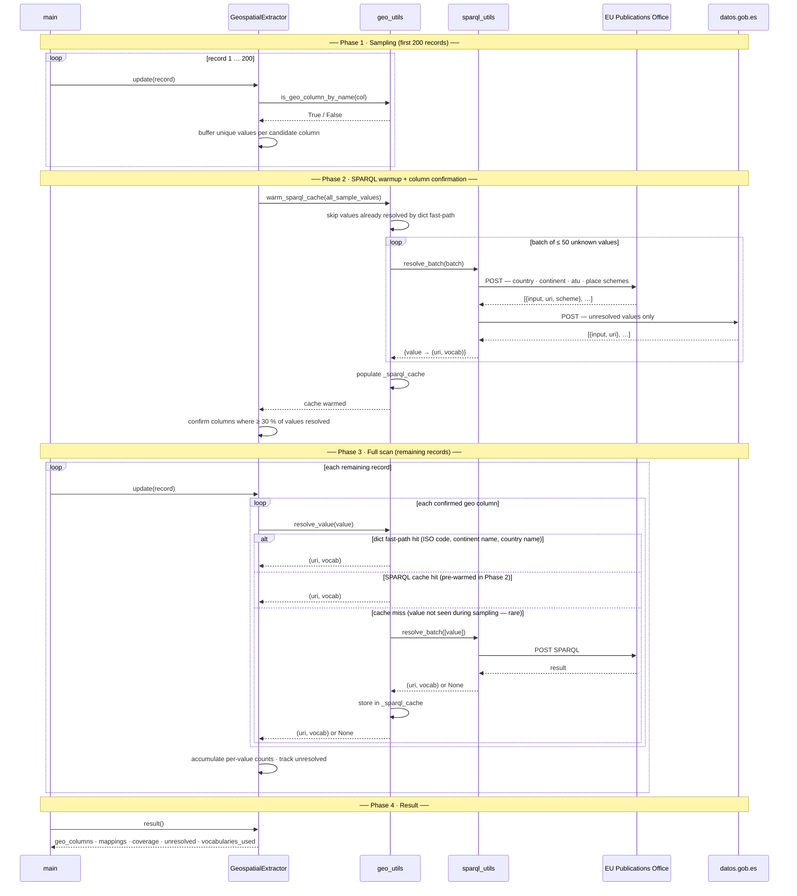
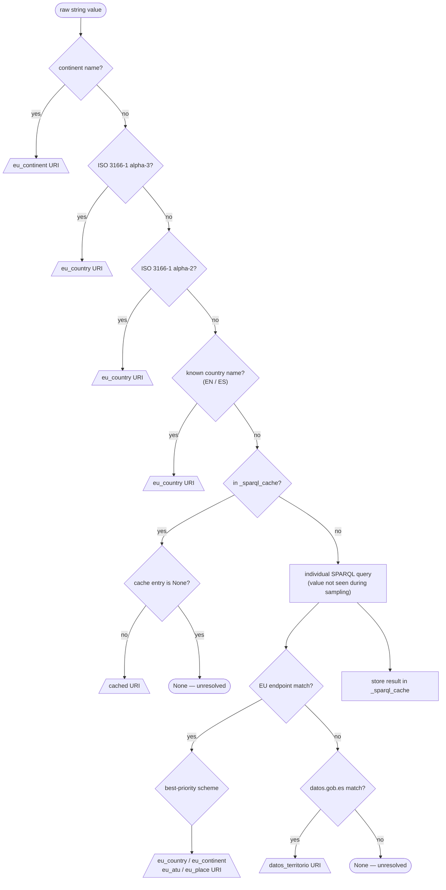

# Geospatial Extraction — How It Works

The geospatial extractor maps free-text geographic values (country codes, region names, city names, etc.) to linked-data URIs in a single streaming pass over the file. It minimises network calls by batching SPARQL queries at the end of the sampling phase, before the full scan begins.

---

**Resolution order (first match wins):**

| Priority | Input | Method | Vocabulary | Example URI |
|----------|-------|--------|------------|-------------|
| 1 | Continent name | built-in dict | `eu_continent` | `…/authority/continent/EUROPE` |
| 2 | ISO 3166-1 alpha-3 | built-in dict | `eu_country` | `…/authority/country/ESP` |
| 3 | ISO 3166-1 alpha-2 | built-in dict | `eu_country` | `…/authority/country/ESP` |
| 4 | Country name (EN/ES) | built-in dict | `eu_country` | `…/authority/country/ESP` |
| 5 | Region / city / place | SPARQL | `eu_atu`, `eu_place` | `…/authority/atu/ES511` |
| 6 | Spanish territory | SPARQL | `datos_territorio` | `datos.gob.es/…/territorio/…` |

**SPARQL endpoints queried:**
- EU Publications Office: `https://publications.europa.eu/webapi/rdf/sparql`
  — searches `country`, `continent`, `atu` (NUTS regions), and `place` schemes
- datos.gob.es: `https://datos.gob.es/virtuoso/sparql`
  — searches the Spanish territory hierarchy

**Query minimisation strategy:**
After the sampling phase, all unique values that the built-in dicts could _not_ resolve are sent to the SPARQL endpoints in a single batch (up to 50 values per request). The full scan then reads from the in-memory cache — no further network calls unless a completely new value appears.

## Four phases

---

## Resolution pipeline (per value)

---

## Vocabularies and scheme priority

When a value matches multiple schemes in the EU endpoint (e.g. "Madrid" appears in both `atu` and `place`), the match with the **lowest priority number** is returned.

| Priority | Vocabulary | Scheme URI | Example |
|----------|------------|------------|---------|
| 1 | `eu_country` | `…/authority/country` | `…/country/ESP` |
| 2 | `eu_continent` | `…/authority/continent` | `…/continent/EUROPE` |
| 3 | `eu_atu` | `…/authority/atu` | `…/atu/ES511` |
| 4 | `eu_place` | `…/authority/place` | `…/place/MADRID` |
| 5 | `datos_territorio` | `datos.gob.es/…/territorio` | `…/territorio/Municipio/28079` |

---

## How queries are limited

| Situation | Queries sent |
|-----------|-------------|
| Value resolves via dict fast-path (ISO code, country name, continent) | **0** |
| Value is unknown — batch warmup during Phase 2 | **1 EU + 1 datos per 50 values** |
| Value appears for the first time during the full scan (cache miss) | **1 EU + 1 datos** |
| Same value seen again anywhere | **0** (cache hit) |

For a typical dataset with 80 unique geographic values where 30 are ISO codes and 50 are region names:
- Phase 2 sends **2 requests** (1 EU + 1 datos for the 50 unknown values)
- Full scan sends **0** additional requests
- Total: **2 HTTP requests** regardless of record count

---

## Column detection

A column is considered geographic if it passes **both** filters:

1. **Name filter** — the column name contains a keyword from the configured list:
   `country`, `region`, `city`, `province`, `state`, `municipality`, `continent`, `territory`, `place`, `pais`, `ciudad`, `provincia`, `municipio`, `localidad`, `pays`, `ville`, `land`, `ort`, …

2. **Value filter** — at least **30 %** of the sampled values (up to 200) resolve to a URI.
   This check runs *after* the SPARQL cache is warmed, so region-name columns (e.g. `region = ["Cataluña", "Andalucía", "Madrid"]`) pass even though the dict fast-path alone would score 0 %.

Columns that pass the name filter but contain non-geographic data (e.g. `state = ["active", "inactive"]`) are rejected at this stage.
